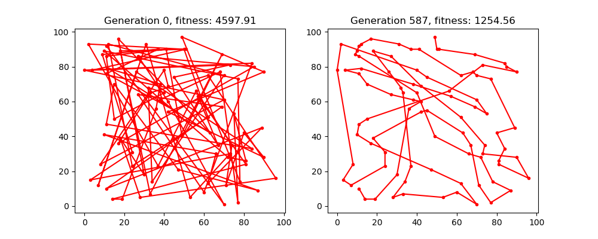
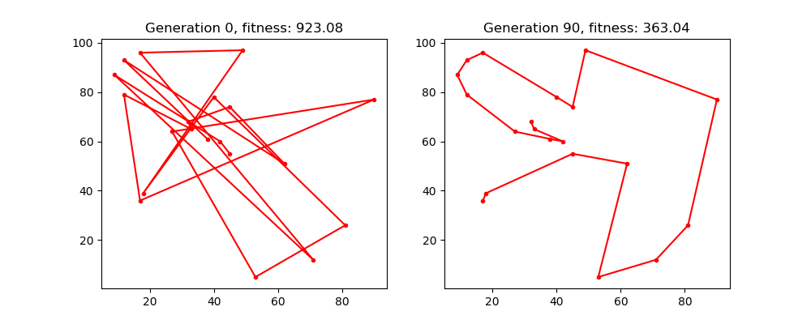

# GENALG

Example of a genetic algorithm solution to traveling salesman problem.

```python

import logging
from genalg.algorithm import GeneticAlgorithm, Problem

cities = [(20, 30), (50, 10), (21, 22), (35, 40),
          (10, 15), (91, 21), (25, 22), (55, 11),
          (12, 12), (13, 55), (51, 69), (52, 25),
          (13, 14), (51, 85), (11, 99), (82, 44),
          (33, 24), (93, 22), (85, 29), (21, 19)]

problem = Problem(cities=cities)
ga = GeneticAlgorithm(problem=problem)
solution = ga.compute(n_generation=50)

print(solution.fitness)
print(solution.path)
```



